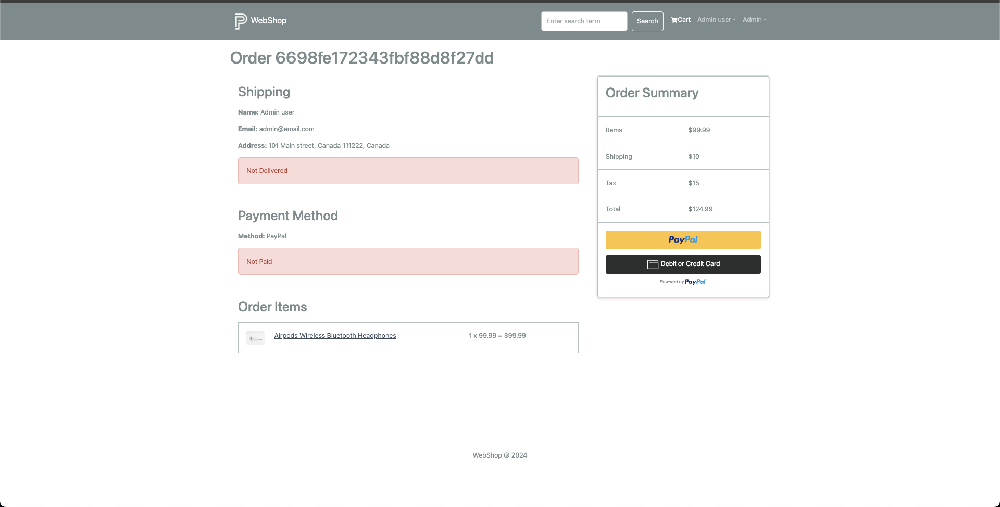

### Webshop

App is deployed at `https://webshop-wir3.onrender.com`

- React based online shopping app.
- Nodejs as backend with mongo cloud db as persistence.
- jwt cookie for auth and CRA build for frontend.
- Redux toolkit for state management.
- Paypal integration works.
- Multi step checkout with feature to return back to previous step.

### users

admin: admin@email.com pwd: 123456
Jhon Doe: jdoe@email.com  pwd: 123456
and others.

### Generic

DB is hosted on remote mongo db cluster but it can be configured locally to run whole setup local.

### Scripts (How to's)

- Mostly if you are starting afresh, db will already loose the seed data and hence no product will be
  avaialble on ui or via api's. To fix this, run `npm run data:import` after providing/updating correct db
  string in .env file(s), if needed.

  Once data is imported then usual script to run both frontend and backend together will be
  `npm run dev`. If no errors in console, you are good and will see landing view of the ui on frontend
  port `3000` with images of different products.

### UI

#### Product added to cart

#### Landing page with carousel

#### Paypal checkout page

#### Admin profile page

#### Admin product administration page

#### Ratings and Reviews

